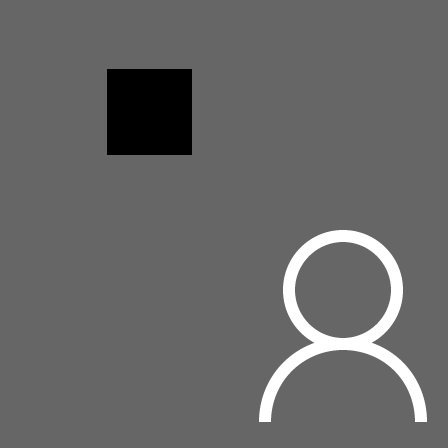

## Author:陈钦德

## Student id：17343010

##Ex1：图像读取和显示以及像素操作 

### 1.测试环境

- win10 64bits
- MinGW64

### 2.测试数据

我们这次的任务是修改提供的一张图片：

### 3.测试结果

- 1. 读入1.bmp文件，并用CImg.display() 显示。 

结果如下图所示：

- 2.  把1.bmp文件的白色区域变成红色，黑色区域变成绿色

- 3. 在图上绘制一个等边三角形区域，其中心坐标(50,50)，边长为40，填充颜色为 蓝色。 

首先是不用CImg的函数调用的结果。

然后是使用CImg函数调用的结果。

- 4. 在图上绘制一个圆形区域，圆心坐标(50,50)，半径为15，填充颜色为黄色

首先是不用CImg的函数调用的结果。

然后是使用CImg函数调用的结果。

- 5.  在图上绘制一条长为100的直线段，起点坐标为(0, 0)，方向角为135度，直线 的颜色为绿色。 

首先是不用CImg的函数调用的结果。

然后是使用CImg函数调用的结果。

- 6. 把上面的操作结果保存为2.bmp。 

### 4.对结果的分析

我们需要比对一下上面使用CImg调用函数和不适用的差异。

#### a. 首先看第三步，绘制等边三角形。

我在放大800%的时候，进行了对比，左边为调用函数进行绘制的，而右边是我手动绘制的。

可以看得到两者差别不是非常的大，但是不调用函数绘制的可能比使用函数绘制的要小一点。

于是我仔细去看了一下他们三个点的分别坐标。
(30,38) (70,38) (50,73)这是使用函数绘制的三个点的坐标，这和计算出来的结果是一样的，(30,38) (70,38) (50,72)这是不调用函数时候的三个点，发现最下面的点比调用函数绘制的少了一个像素值大小。

#### b. 然后是第四步画一个圆。

我在放大800%的时候，进行了对比，左边为调用函数进行绘制的，而右边是我手动绘制的。

我们可以看得到它们之间的差距，函数调用绘制的圆，在其上下左右的四个边缘都是直的但是比较短，相对而言我直的区域比较长。

#### c. 然后是第五步在方向角135°画一条线。

135°画这一条线，我不知道这个角度应该怎么计算，但是因为是需要展示的结果，我直接把当前象限当作第四象限来处理了。

我在放大800%的时候，进行了对比，左边为调用函数进行绘制的，而右边是我手动绘制的。

经过对比我们可以看得到我自己绘制的直线明显要短一点点，实际上我确定了一下它们的坐标值，调用函数绘制的坐标值为(70,69)，我绘制的坐标值为(71，71)，发现世界上手绘的直线更低一点，和我计算出来的坐标有所差距。
