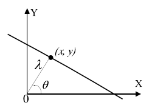
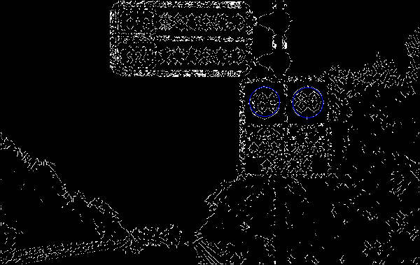
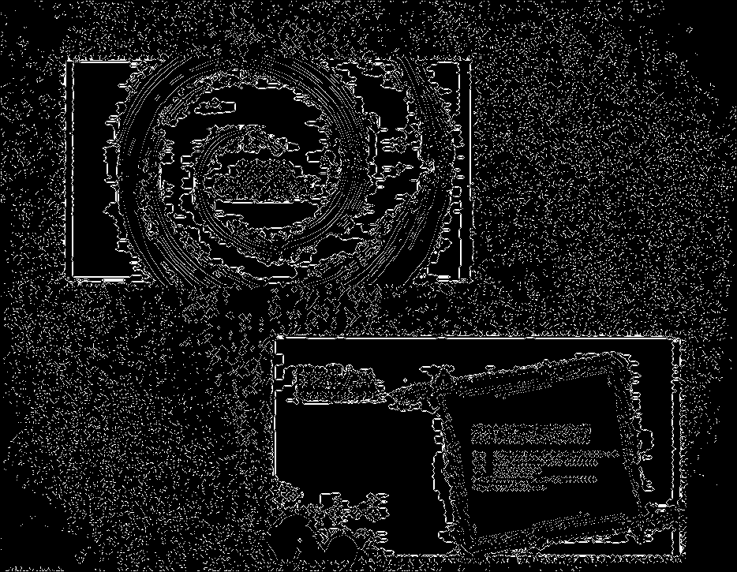
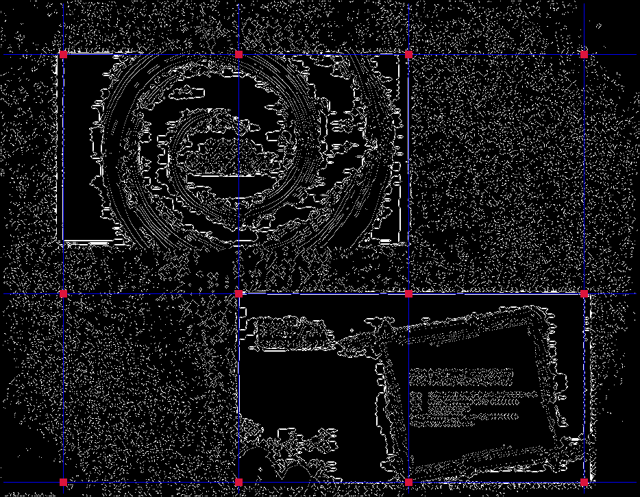

### 姓名：陈钦德&emsp;学号：17343010&emsp;专业：软件工程

###作业3-1

输入普通的A4打印纸的图片然后找出它的边缘同时找出其四个角。

其实这一次的题目就是比之前多了个霍夫变换的直线和圆的检测，关于边缘检测我们继续使用Canny的方式进行检测，但是在这一次作业没有要求使用上次的代码，我首先是重新实现了一下canny的内容，因为之前的代码要求在原本基础上修改，很多没有办法写的比较方便，这一次首先是重新修改的比较方便使用。

修改了一下计算梯度的过程、非极大值抑制和双阈值方法。

然后我们就开始做我们的霍夫变换了，首先霍夫变换的原理本质上是把一个在于空间域的直线笛卡尔坐标的转化为在极坐标下的表示，然后再通过遍历查找出可能性最大的直线，这里的可能性是怎么定义的呢？

我们通过我们的计算，我们可以算在在（θ，r）下面的某个点的投票数，也就说从笛卡尔空间映射到霍夫空间某个点的个数，当霍夫空间某个点的个数躲到一定程度的时候，这意味在这张图片中有很多点都在这条直线上，所以很有可能这一条直线是存在的，而具体要有多少才认为直线是存在的，这个就是我们自己需要调整的参数了。

下图展示了霍夫变换的映射：

**公式1理解图**

我们有公式$$λ=xcosθ+ysinθ\tag{1}$$

首先做一些前提的准备，因为sin和cos的值经常用到，所以我们直接将它打表，要用的时候直接查表即可。

	for(int i=-90; i<90; i++){
		sin_value[i+90] = sin(i*3.1415926/180);
		cos_value[i+90] = cos(i*3.1415926/180);
	}

首先讲解一下霍夫变换代码的实现：

	void Hough(vector<vector<int> > diretion,CImg<unsigned char> &hough_image,vector<vector<int> > &is_sup,
				char * num_length,int width,int height){
		int tp;
		for(int i=0;i<width;i++){
			for(int j=0;j<height;j++){
				if(diretion[i][j] != 255)
					continue;
				for(int k = 0;k < 180;k++){
					tp = (int)(i*sin_value[k] + j*cos_value[k]) + width + height;
					is_sup[tp][k] += 1;
				}
			}
		}
	}

首先把不可能是边缘的点给排除掉，也就是点的强度等于255的值，因为我们只需要获得边缘点的直线，然后就是通过公式1计算。

计算完之后的结果保存在了is_sup中,因为霍夫变换的图片导入看不清，所以在这里不进行展示了。

然后就是使用计算出来的进行划线，但是直接划线还有找阈值经常不能达到比较好的效果，在这里我进行了一些简单的处理。

	if(is_sup[tp][k] >= length1){
		flag = 0;
		if(new_hough_result_x.size() != 0){
			for(int p = 0;p < new_hough_result_x.size();p++){
				if(new_hough_result_x[p] == tp && new_hough_result_y[p] == k){
					flag = 1;
					break;
				}
				if(abs(new_hough_result_x[p] - tp) <= 100 && abs(new_hough_result_y[p] - k) <=2){
					if(record[tp][k] == 0){
						record[tp][k] = find_best(conlove_image,tp,k);
					}
					if(record[tp][k] >= record[new_hough_result_x[p]][new_hough_result_y[p]]){
						new_hough_result_x[p] = tp;
						new_hough_result_y[p] = k;
					}
					flag = 1;
					break;
				}
			}
			if(flag != 1){
				new_hough_result_x.push_back(tp);
				new_hough_result_y.push_back(k);
			}
		}
		else{
			record[tp][k] = find_best(conlove_image,tp,k);
			new_hough_result_x.push_back(tp);
			new_hough_result_y.push_back(k);
		}
	}

在这里判断如果没有出现过的直线，那么就直接加入我们的记录中，如果说出现和已经加入的和相近的直线（λ之差小于等于100，角度之差小于等于2的），那么我们在这里使用find_best函数进行判断，判断在直线上那个包含的边缘点比较多那么就替换成它。

	int find_best(CImg<unsigned char> image,int tp,int k){
		int width = image.width();
		int height = image.height();
		
		int num = 0;
		for(int i = 0;i < width;i++){
			for(int j = 0;j < height;j++){
				if(tp == (int)(i*sin_value[k] + j*cos_value[k]) + width + height && image(i,j,0) == 255 && image(i,j,1) == 255 && image(i,j,2) == 255)
					num += 1;
			}
		}
		return num;
	}

缺陷是计算效率非常的低，不过提高了一部分的精确度。

然后进一步筛选，把那些没有互相垂直的直线给删除掉，然后就可以我们的结果了。

**IMG_20150320_143133.bmp的边缘图**

**IMG_20150320_143133.bmp的画线图**

我们能看到效果还是不错的。因为位置的原因这里就不展示所有的结果了。

###作业3-2

第二个作业和第一个作业相似都是霍夫变换的检测，不过这里是检测圆的，相对于直线而言，圆的检测比直线多了一个参数，我们可以增加一维保存数据。

我们知道圆的方程为$$R^2 = (x-a)^2 + (y-b)^2\tag{2}$$

我们交换一下然后换到极坐标去。$$  X_0  =  X   +   R * cos(\Theta)$$

$$Y_0  =  Y   +   R * sin(\Theta)$$

在这里我们自己指定R的范围进行搜索。

**2.bmp的边缘**

**2.bmp的画线图**

###作业3-3

最后对于附加题，主要噪音有点多也不太好分，这是我做的结果。

**1.bmp的边缘**

**1.bmp的画线图**

