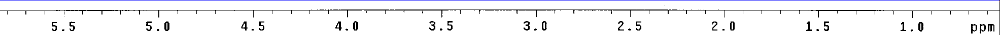

## 姓名：陈钦德&emsp;学号：17343010&emsp;专业：软件工程

##作业4

## 任务一：把图像的前后景分割。

把前景和后景给分割出来，一般来说，前景是我们所感兴趣的部分，而后景是我们不需要的、可以掠过的部分，而我们怎么对于前后景进行分割呢？

我们需要进行如下的步骤：

- 把彩色图像转化为灰度图像
- 找出一个适合的阈值
- 把大于阈值的灰度值设置为255，把小于阈值的灰度值设置为0.
- 保存图像。

对于转化为灰度图像我们可以使用如下的公式进行转化：

$$gray = 0.299R + 0.587G + 0.114B\tag{1}$$

具体的转化灰度值的函数分别实现在change_gray、change_gray1、change_gray2里面。

当我们成功转化为灰度图像之后，我们需要做的是找出过一个确定的阈值，同时因为确定阈值的方式基本上就是不同方法的主要区别了，所在在这里实现的三种分割前后景的方式实际上是寻找阈值的不同方式。

### 双峰法

双峰法主要处理有多个比较明显的峰值的图像比较适合，对于直方图整体比较均很的就没有办法处理了。

在使用双峰法之前首先需要找出图像的直方图，双峰法是在直方图的基础上进行实现的。

双峰法的具体做法是找到直方图中两个比较大的峰值，然后取两个峰值之中的低谷作为分割的阈值。如图1. 所示我们可以看到对于两个峰的情况。

<strong>图1. 双峰法双峰的情况</strong>

当然，双峰法对于多峰的情况也可以进行处理，如图二所示。

<strong>图2. 双峰法多峰的情况</strong>

具体的代码实现：

- 做出直方图的数组
- 然后开始寻找峰值(在这里我是用双峰来判断的)
- 遍历直方图，寻找到最大的峰值，然后再遍历一次寻找到次之的峰值。
- 最后在两个峰值之间找到最小的值，作为最后分割的阈值。

建立直方图的代码
   
	int bins[256] = {0};
	for(int i=0;i<width;i++)
		for(int j=0;j<height;j++)
				bins[this->gray(i,j)] += 1;
    	
寻找到第一个峰值

	for(int i = 1;i < 255;i++){
		if(bins[i] > max_one && bins[i] > bins[i + 1] && bins[i] > bins[i - 1]){
			max_one = bins[i];
			pos1 = i;
		}
	}

寻找到第二个峰值

	for(int i = 1;i < 255;i++){
		if(bins[i] < max_one && bins[i] > max_two && bins[i] > bins[i + 1] && bins[i] > bins[i - 1]){
			max_two = bins[i];
			pos2 = i;
		}
	}

在两个峰值之间找到最小的值，作为最后分割的阈值。

	for(int i = pos1;i < pos2;i++){
		if(bins[i] < max_one){
			max_one = bins[i];
			new_T = i;
		}
	}

### 迭代法

这是另一个找到阈值的方法，通过不断的迭代找出最好的值，具体步骤如下：

- 随机初始化一个T
- 通过T对图像进行分割为$G_1$和$G_2$，计算出两个域的密度$m_1$、$m_2$
- 更新阈值为$T_{new} = \frac{m_1 + m_2}{2}$
- 如果$|T - T_{new}| > \bigtriangleup T $的话，那么就返回第二步，然后继续，直到结束为止。

具体代码如下：
	
	while(abs(new_T - T) > betaT){
		m1 = 0;m2 = 0;
		for(int i=0;i<width;i++){
			for(int j=0;j<height;j++){
				if(this->gray(i,j) > new_T)
					m1 = (m1 + this->gray(i,j)) / 2;
				else
					m2 = (m2 + this->gray(i,j)) / 2;
			}
		}
		T = new_T;
		new_T = (m1 + m2)/2;
	}

随机设定一个T然后进行循环，直到符合$|T - T_{new}| > \bigtriangleup T $为止。

### Otsu方法(大津法)

大律法主要是对于分割的两个图像，计算两个图像的方差进行比较，当两者方差足够大的时候，我们可以认为这张图像的前景和后景被分割开来了，通过循环找到最合适的阈值。

具体的步骤如下：

- 建立直方图
- 计算出分布频率和累积分布频率。
- 遍历阈值k，将图像分割成$C_1$和$C_2$,然后分别计算它们的密度均值$m_1和m_2$
- 计算类间方差，保存方差最大的阈值

我们来看代码的具体实现.

首先是计算直方图
	
	int bins[256] = {0};
	for(int i=0;i<width;i++)
		for(int j=0;j<height;j++)
				bins[this->gray(i,j)] += 1;
然后是计算分布频率,也即公式$$p_i = \frac{bins[i]}{ImageWidth * ImageHeight}\tag{2}$$

	for(int i = 0;i < 256;i++)
		P[i] = bins[i] *  1.0 / MN ;

计算累积分布频率频率，同时为了方便，也同时计算一个加权的WC值，也就是公式$$C_i = \sum_{i=0}^k p_i \tag{3}$$

$$WC_i = \sum_{i=0}^k i * p_i\tag{4}$$

		C[0] = P[0];
		for(int i = 1;i < 256;i++){
			WC[i] = WC[i-1] + i * P[i];
			C[i] = C[i-1] + P[i];
		}

然后是进行遍历循环,通过如下公式计算方差$$\sigma_B^2 = \frac{(m_G P_1 - m) ^ 2}{P_1 * (1 - P_1)}$$

$m_G$为全局平均密度

		mg = WC[255];
		for(int k = 0;k < 256;k++){
			P1 = C[k];
			P2 = 1 - C[k];
			m1 = WC[k] / P1;
			m2 = (WC[255] - WC[k])/ P2;
			m = WC[k];
			betaB = (mg * P1 - m) * (mg * P1 - m) / (P1 * (1-P1));
			if(betaB > MaxbetaB){
				MaxbetaB = betaB;
				fit_T = k;
			}
		}

最后展示具体的效果：

<strong>图3. 原图&emsp;&emsp;&emsp;&emsp;&emsp;&emsp;&emsp;&emsp;&emsp;&emsp;&emsp;&emsp;&emsp;&emsp;图4. 双峰法</strong>

<strong>图5. 迭代法&emsp;&emsp;&emsp;&emsp;&emsp;&emsp;&emsp;&emsp;&emsp;&emsp;&emsp;&emsp;&emsp;&emsp;图6. 大律法</strong>

<strong>图7. 原图&emsp;&emsp;&emsp;&emsp;&emsp;&emsp;&emsp;&emsp;&emsp;&emsp;&emsp;&emsp;&emsp;&emsp;图8. 双峰法</strong>

<strong>图9. 迭代法&emsp;&emsp;&emsp;&emsp;&emsp;&emsp;&emsp;&emsp;&emsp;&emsp;&emsp;&emsp;&emsp;&emsp;图10. 大律法</strong>

<strong>图11. 原图&emsp;&emsp;&emsp;&emsp;&emsp;&emsp;&emsp;&emsp;图12. 双峰法</strong>

<strong>图13. 原图&emsp;&emsp;&emsp;&emsp;&emsp;&emsp;&emsp;&emsp;图14. 双峰法</strong>

## 任务二： 把图像中的数字切割出来, 基本思路如下: 

- 1. 先做图像的 Delate(膨胀操作). 
- 2. 求出图像中的连通块. 
- 3. 去除黑色像素大于 T(T=100)的联通块. 
- 4. 在原图上把联通块(黑色像素<=T)用红色框标记(即用红色框围住联通块, 如下图的红色框) 

#### 1. 先做图像的 Delate(膨胀操作). 

首先第一步进行图像的膨胀，我们直到膨胀就是对于k*k领域的扩散，在这里我们的具体做法是：

- 寻找到一个阈值为0的，如果其定义的核内存在着0，那么就修改其为0.

<strong>图15. 我所采用的膨胀的核</strong>

代码如下图所示：

	for(int i=1;i<width-1;i++){
		for(int j=1;j<height-1;j++){
			if(gray(i,j) == 0 || gray(i-1,j) == 0 || gray(i+1,j) == 0 || gray(i,j-1) == 0 || gray(i,j+1) == 0){
				gray1(i,j) = 0;
			}
			else
				gray1(i,j) = 255;
		}
	}

把符合条件的像素点都进行碰撞，效果如下图所示

<strong>图16. 膨胀1次&emsp;&emsp;&emsp;&emsp;&emsp;&emsp;&emsp;&emsp;&emsp;&emsp;&emsp;&emsp;&emsp;图17. 膨胀2次</strong>

<strong>图18. 膨胀4次&emsp;&emsp;&emsp;&emsp;&emsp;&emsp;&emsp;&emsp;&emsp;&emsp;&emsp;&emsp;&emsp;图19. 膨胀8次</strong>

#### 2. 求出图像中的连通块.

这一步并不复杂，只需要找到对应的点然后从邻域找到之后不断寻找下去就可以了。

这一步本来是使用递归的写法的，但是好像有些连通块太过于长了，导致递归的次数好像太多了而无法进行下去，所以最后代码又改成了非递归的写法。

具体代码如下：

	this->mapping[i][j] = true;
	int length = 0;
	int x,y;
	vector<int> x_point,y_point;
	x_point.push_back(i);
	y_point.push_back(j);
	int now;
	while(x_point.size() != 0){
		now = x_point.size() - 1;
		i = x_point[now];
		j = y_point[now];
		length += 1;
		x_point.pop_back();
		y_point.pop_back();
		for(int p = 0;p < 3;p++){
			for(int k = 0;k < 3;k++){
				x = i + L[p];
				y = j + L[k];
				if(x >= 0 && x <= width-1 && y >= 0 && y <= height-1 && this->gray(x,y) == 0 && this->mapping[x][y] == false){
					this->mapping[x][y] = true;
					x_point.push_back(x);
					y_point.push_back(y);
				}
			}
		}
	}

首先是通过mapping来记录那些连通块访问过，如果访问过了就不访问了，负责的话加入队列中，每一次都从队列中取出一个点，然后进行扩散，记录值，然后直到队列清空为止。

#### 3. 去除黑色像素大于T(T=100)的联通块。

在上面的求联通块的时候我们已经同时记录了长度，这个时候我们就需要让长度大于阈值的删掉，当然，我们这里使用的并不是100，而是245。

我们要实现的函数就是将长度大于阈值的删除掉，代码实现如下：

	int x,y;
	vector<int> x_point;
	vector<int> y_point;
	x_point.push_back(i);
	y_point.push_back(j);
	int now;
	while(x_point.size() != 0){
		now = x_point.size() - 1;
		i = x_point[now];
		j = y_point[now];
		x_point.pop_back();
		y_point.pop_back();
		for(int p = 0;p < 3;p++){
			for(int k = 0;k < 3;k++){
				x = i + L[p];
				y = j + L[k];
				if(x >= 0 && x <= width-1 && y >= 0 && y <= height-1 && result(x,y) == 0){
					result(x,y) = 255;
					x_point.push_back(x);
					y_point.push_back(y);
				}
			}
		}
	}

不断的循环，并且找到是0的值的时候，我们就把它设置为255.

这是最后的效果图。

<strong>图20. 删去大于T的联通块</strong>

#### 4. 在原图上把联通块(黑色像素<=T)用红色框标记(即用红色框围住联通块, 如下图的红色框) 

标记出联通块我们需要联通块的坐标，但是这个坐标怎么得到呢？

最后我是在寻找联通块的时候得到的，寻找联通块的同时，记录联通块最左、最上、最右和最下的坐标，然后返回作为我们需要划红框的坐标。

具体代码核心实现如下：

	if(i < left)
		left = i;
	if(i > right)
		right = i;
	if(j > bottom)
		bottom = j;
	if(j < top)
		top = j;

delete函数()
	
	int left,right,top,bottom;
	for(int i=0;i<width;i++){
		for(int j=0;j<height;j++){
			if(gray(i,j) == 255 || this->mapping[i][j] == true){
				this->mapping[i][j] = true;
			}
			else{
				left = width;right = 0;top = height;bottom = 0;
				this->mapping[i][j] = true;
				length = find_length(i,j,threshold,left,right,top,bottom);
				if(length >= threshold)
					dispose_T(result,i,j);
				else{
						if(abs(right - left) <= 25 && abs(top - bottom) <= 25)		
							this->image.draw_rectangle(left, top,right, bottom,this->red,1,~0U);
					}
				}
			}
			
		}
	}
	this->gray = result;

找到一个黑色像素就寻找它的长度，然后对于寻找到的就不断的标注，之后不再寻找，同时如果长度大于阈值，那么就把联通块删掉，因为我们需要找到的是数字的联通块，所以我这里设定了一个限制就是长宽都要小于25的联通块会被标注红框。

主要是增加了寻找边缘坐标的内容，最终的效果如下：

<strong>图21. 标记红框</strong>

## 任务三： 把图像中标尺 OCR, 基本思路: 

- 1. 计算标尺对应的位置和区域(即上图的蓝色框区域). 
- 2. 识别标尺图像中的刻度数字, 可以调用 OpenCV. 

### 1. 计算标尺对应的位置和区域(即上图的蓝色框区域). 

首先我们来完成第一个任务，我们需要找出标尺所在的位置，但是实际上我们并没有办法让代码自己识别出这个是标尺然后自动标注，我们只能认为的得到一些特征然后让代码计算出标尺的位置。

在这里我找出标尺位置的方法是找出全图最长的水平线然后记录最左、最右还有y轴坐标，然后将左右延申10个像素，上延申20个像素，向下延申四十个像素。

具体核心代码如下：

	for(int i=1;i<width-1;i++){
		for(int j=1;j<height-1;j++){
			if(this->gray(i,j) == 0){
				length = 0;
				for(int p = i + 1; p < width; p++){
					if(this->gray(p,j) == 0)
						length += 1;
					else
						break;
				}
				if(length > max_length){
					left1 = i;
					right1 = i + length;
					top1 = j;
					bottom1 = j;
					max_length = length;
				}
			}
		}
	}
	this->image.draw_rectangle(left1-10, top1-20,right1+10, bottom1+50,this->blue,1,~0U);

在图像中找到最长的水平线然后标注为蓝色的。

同时我们要找到在标尺上的数字，我们在标尺的范围检测，和之前检测跑联通块是一样的，具体代码如下:

	rect t;
	for(int i=left1;i<right1;i++){
		for(int j=top1;j<bottom1+50;j++){
			if(gray(i,j) == 255 || this->mapping[i][j] == true){
				this->mapping[i][j] = true;
			}
			else{
				left = width;right = 0;top = height;bottom = 0;
				this->mapping[i][j] = true;
				length = find_length(i,j,245,left,right,top,bottom);
				if(length < 245 && length > 100){		
					t.left = left;
					t.right = right;
					t.top = top;
					t.bottom = bottom;
					this->to_dic.push_back(t);
				}
			}
			
		}
	}
	for(int i = 0;i < 3;i++)
		this->to_dic.pop_back();

同时把检测的联通块放在to_dic这一个vector里面，以待后面使用，因为我们直到最后三个并非数字，但是有比较难以区分掉，所以我们进行手动删去。

这是最后的展示结果。

<strong>图22. 找出标尺</strong>

### 2. 识别标尺图像中的刻度数字, 可以调用 OpenCV. 

首先对于手写数字的识别，这里采用了两种方式，第一种是调用tesseract进行识别，第二种是找一个模板，然后计算距离，选择距离最小的进行匹配，相当于一个低配版的KNN。

### 第一种方法

首先将图像找出来，然后进行重新拉伸之后调用tesseract进行识别。

具体代码如下：

	char name[150] = "tesseract tesseract_recognition/resultA.bmp tesseract_recognition/resultA digits";
	char pic_name[100] = "tesseract_recognition/resultA.bmp";
	for(int i = 0;i < this->to_dic.size();i++){
		this->image.draw_rectangle(to_dic[i].left, to_dic[i].top,to_dic[i].right, to_dic[i].bottom,this->red,1,~0U);
		CImg<unsigned char> number_image(to_dic[i].right - to_dic[i].left,to_dic[i].bottom - to_dic[i].top,depth,1);
		for(int j = to_dic[i].left;j < to_dic[i].right;j++){
			for(int k = to_dic[i].top;k < to_dic[i].bottom;k++){
				number_image(j - to_dic[i].left,k - to_dic[i].top) = this->gray(j,k);
			}
		}
		number_image.save("123.bmp");
		Mat src_color = imread("123.bmp");  
		int c=src_color.cols/2;
		int r=src_color.rows/2;  
		Mat src_gray;
		Mat src_gray_resize; 
		cvtColor(src_color, src_gray, COLOR_BGR2GRAY);
		resize(src_gray, src_gray_resize, Size(512, 512), 0, 0, INTER_LINEAR);
		imwrite(pic_name, src_gray_resize);
		system(name);
		name[38] += 1;
		name[72] += 1;
		pic_name[28] += 1;
	}

使用之前保存的to_dic的数字保存到我们需要的位置，然后使用opencv内置的库调整图像的大小，最后使用tesseract进行识别。

<strong>图23. 数字5的识别结果&emsp;&emsp;&emsp;&emsp;&emsp;&emsp;&emsp;&emsp;&emsp;图24. 数字4的识别结果</strong>

我们可以看得到尽管已经使用了digits在最后作为只识别符号和数字的指令，但是对于最终的效果仍然不是非常的好。

### 第二种方法

第二种方法采用找一个模板然后计算距离，最后选择距离小的，认为就是那个数字。

我们首先要创建一个模板出来，我使用了画图工具在上面使用了等线的字体找出作为了数字的模板，如下图所示:

<strong>图25. 模板数字</strong>

当然，这个样子直接使用是不太可能的我们需要对其进行分割，因为我们大致的一个范围，所以我们指定一个比较合理的范围后，我们通过上面寻找联通块的方式定位出我们需要的标准数字的坐标。

具体代码如下：

	rect t;
	int length,left,right,top,bottom;
	for(int i=130;i<430;i++){
		for(int j=148;j<180;j++){
			if(gray(i,j) == 255 || this->mapping[i][j] == true){
				this->mapping[i][j] = true;
			}
			else{
				left = width;right = 0;top = height;bottom = 0;
				this->mapping[i][j] = true;
				length = find_length(i,j,245,left,right,top,bottom);
				t.left = left-2;
				t.right = right+2;
				t.top = top-2;
				t.bottom = bottom+2;
				this->to_dic.push_back(t);
			}
			
		}
	}

上面这一部分是找出我们需要定位的数字的位置，这里同样使用to_dic来保存它们。

	char name[20] = "digits/0.bmp";
	for(int i = 0;i < this->to_dic.size();i++){
		CImg<unsigned char> number_image(to_dic[i].right - to_dic[i].left,to_dic[i].bottom - to_dic[i].top,depth,1);
		for(int j = to_dic[i].left;j < to_dic[i].right;j++)
			for(int k = to_dic[i].top;k < to_dic[i].bottom;k++)
				number_image(j - to_dic[i].left,k - to_dic[i].top) = this->gray(j,k);
		number_image.save(name);
		name[7] += 1;
	}

上面这一部分是将模板数字进行保存，具体效果如下可见:

<strong>图26. 分割的模板数字</strong>

然后我们把数字处理好之后，我们需要读取数字然后进行识别，如下是读取数字的具体代码：

	void HomeWork4::read_digits(){
		char name[20] = "digits/0.bmp";
		for(int i = 0;i < 10;i++){
			CImg<unsigned char> number_image;
			number_image.load_bmp(name);
			this->digits.push_back(change_gray2(number_image));
			name[7] += 1;
		}
	}

然后我们对具体数字进行识别：

	int HomeWork4::dic_num(int left,int top,int right,int bottom){
		int width,height,dis,num=0,min_length=-1;
		for(int i = 0;i < this->digits.size();i++){
			CImg<unsigned char> gray1 = this->digits[i];
			width = gray1.width() < right - left ? gray1.width():right - left;
			height = gray1.height() < bottom - top ? gray1.height():bottom - top;
			dis = 0;
			for(int j = 0;j < width;j++){
				for(int k = 0 ;k < height;k++){
					dis += (this->gray(left + j, top + k) - gray1(j,k)) * (this->gray(left + j, top + k) - gray1(j,k));
				}
			}
			if(min_length == -1)
				min_length = dis;
			if(min_length > dis){
				min_length = dis;
				num = i;
			}
		}
		return num;
	}
我们对于保存的数字一个拿出来进行循环，然后计算两者之间的欧式距离，最后把距离最小也就是两者之间最相近的给保存起来，得到最后的结果。

具体的结果如下可视：

<strong>图27. 使用模板数字的识别结果</strong>

我们可以看得到所有的数字都能够准确的识别出来了。

最后对于具体的代码详情可见readme.md。