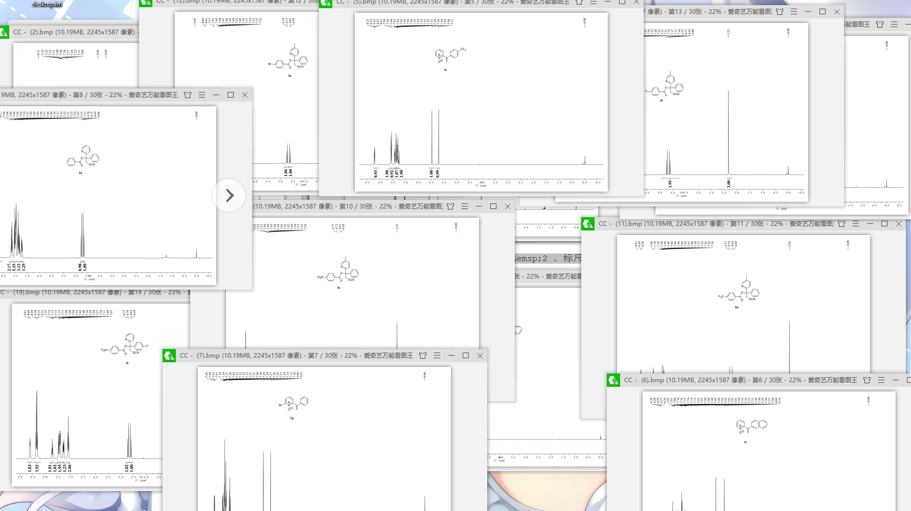
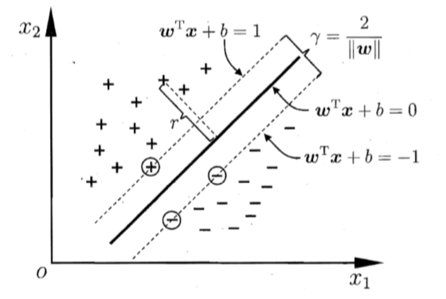
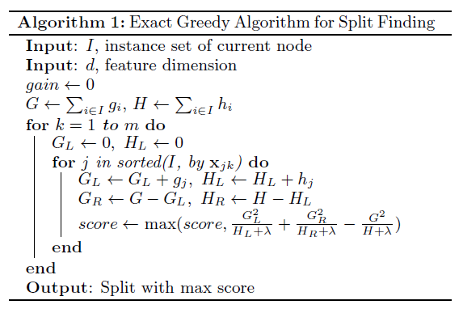
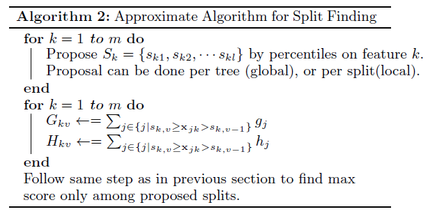
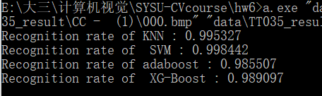

## 姓名：陈钦德&emsp;学号：17343010&emsp;专业：软件工程

##作业6

## 实验内容：
- 1. 根据下面给定的数据, 自己做切割, 聚类, 人工标注, 获得印刷体的数据集. 数据链接：https://pan.baidu.com/s/1DNdEPXm5Qh9Uhz80OlnDhw  提取码：f4jl  
- 2. 第一步: 用一半的数据训练, 一半用于测试, 完成测试报告. 
- 3. 第二步: 对所有图像完成作业 5 的步骤, 并给出测试报告和准确率对比. . 
- 4. 采用的方法分别是: SVM, Adaboost, KNN, XG-Boost. (4 个方法都做, 比较不同方法的效果). 

### 1. 数据预处理

首先我们要获取数据，然后将数据处理成我们需要的内容。

我们得到的原始数据如下：

<strong>图1。数据一览</strong>

我们发现都是和作业5差不多的数据，基本上使用作业5的代码就能够得出我们需要的内容了。

实现的步骤和之前一样，首先是进行八次膨胀同时删除掉太长的部分，然后进行水平聚类同时删除掉一些水平太少的区域，最后保留下来的三个就是我们所需要要的三个区域了，同时还需要调整需要的区域就是标尺的位置和括号的位置，我们通过find_rule函数找出标尺所在的位置，然后通过这个我们可以划分出哪一个是标尺小的数字哪一个是括号下的数字。

我们可以看得到这些图片我们需要提取的内容基本上都处于这三个区域：

<strong>图2。使用作业5划分的三个区域</strong>

这划分的三个区域还是和之前一样。

第一部分，也就是红色部分是上方的数字。

第二部分，也就是蓝色部分，是属于标尺的内容。

第三部分，也就是绿色部分，这部分是属于括号的内容。

因为我们的目标是把所有的数字都识别出来，所以我们这一次的任务就是把里面所有的数字都给提取出来，我们在我们划分的区域之类把所有的数字都分割出来。

如下图所示：

<strong>图3。把三张图三个区域的数字分割出来</strong>

我们将数字划分出来之后，我在这里进行的处理是将数字重新保存起来，然后进行识别。

在这里实现write_result函数，将数字保存起来，代码如下：

	if((every_num[i][j].right - every_num[i][j].left) < (every_num[i][j].bottom - every_num[i][j].top)){
		CImg<unsigned char> number_image(every_num[i][j].right - every_num[i][j].left + 2,
				every_num[i][j].bottom - every_num[i][j].top + 2,depth,1);
		for(int p = every_num[i][j].left - 1;p < every_num[i][j].right + 1;p++){
			for(int k = every_num[i][j].top - 1;k < every_num[i][j].bottom + 1;k++){
				number_image(p - every_num[i][j].left + 1,k - every_num[i][j].top + 1) = this->gray(p,k);
			}
		}
		number_image.resize(15,25).save(name1);
		name1[30] += 1;
		the_num++;
	}else{
		CImg<unsigned char> number_image(every_num[i][j].bottom - every_num[i][j].top + 2,
				every_num[i][j].right - every_num[i][j].left + 2,depth,1);
		for(int p = every_num[i][j].left - 1;p < every_num[i][j].right + 1;p++){
			for(int k = every_num[i][j].bottom + 1;k > every_num[i][j].top - 1;k--){
				number_image(every_num[i][j].bottom + 1 - k,p - every_num[i][j].left + 1) = this->gray(p,k);
			}
		}
		number_image.resize(15,25).save(name1);
		name1[30] += 1;
		the_num++;
	}

上面的代码判断了这个数字是竖着的还是躺着的，竖着的比如图3中蓝色区域所示的数字，如果是这种数字，那么直接保存即可；如果说是躺着的也就是如同图3的红色区域和绿色区域的数字，我们这个时候首先需要把数字“扶”起来然后再保存。

同时进行数据的归一化，将所有的图片保存在15*25的大小。然后把图片的中心坐标保存到txt文件之中。

这是数据保存的结果。

<strong>图4。保存的数字数据</strong>

在保存数据之后我们还需要进行数据的标定，这样子我们才能够开始训练。

这一步是手动进行标定的。

<strong>图5。标定的数据</strong>

### 2. 对数据完成作业5的要求

作业5的要求是什么呢？识别出括号出来，同时还有括号左右两边所对应的刻度大小，这一步实际上和之前的代码没有什么区别。

不过还有些地方要进行更加细致的修改，在作业5的数据中对于括号我们是从括号的数字上开始寻找的，但是在这次的数据中我们在一开始的时候并没有办法把括号和数字分开，所以我们直接把它们保存了起来。

然后我们在需要括号的时候我们依旧是在括号的数字上进行寻找，然后找到括号之后，我们把多个括号中最底部的数值保存起来，然后这个数值就是括号下的数字最高的这个区域了。

然后对于绘制括号和标尺的方式也是和之前是一样的。我们可以看到结果如下图所示：

<strong>图6。在三张图上绘制出括号</strong>

然后对于括号标尺的识别结果。

<strong>图7。三张图的括号识别结果</strong>

### 3. 对于数字的识别

我们在这里分别使用四种方法进行识别，分别是SVM, Adaboost, KNN, XG-Boost。

按照老师的说法，我们使用八张数据，我们用一半来训练一半来进行测试。

我们一个个算法来实现，首先是实现KNN。

### KNN

我们来看看KNN的原理。

最近邻居法（KNN算法，又译K-近邻算法）是一种用于分类和回归的非参数统计方法[1]。在这两种情况下，输入包含特征空间（Feature Space）中的k个最接近的训练样本。

然后就要祭出着原理解释的时候非常广泛的原理图。

<strong>图8。经典KNN原理图</strong>

简单来说就是在给定的数据集之中找到给定的距离最近的K个，然后进行投票，最后结果就被分为获票数最多的那个类。

很明显KNN并没有非常显示的训练过程。

如图8所示，我们需要对新来的绿色数据进行分类，分别分为蓝色还是红色。当我们取K = 3 时，我们能看到最近的三个里面有2的红色的，所以这个时候绿色的被分为红色的类别；当K = 5的时候，我们能看到最近的五个中有三个蓝色的和两个红色的，所以当K = 5 的时候这个新来的绿色样本会被分为蓝色的。

原理讲完了，接下来我们需要进行代码的实现了，我们这里借助opencv进行KNN的实现。

	cv::Ptr<cv::ml::KNearest> knn = cv::ml::KNearest::create();
	knn->setDefaultK(k);
	knn->setIsClassifier(true);
	knn->setAlgorithmType(cv::ml::KNearest::BRUTE_FORCE);
	knn->train(this->traindata, cv::ml::ROW_SAMPLE, trainlabel);
	
	cv::Mat result;
	int true_num = 0;
	knn->findNearest(this->testdata, k, result);
	result.convertTo(result, CV_32FC1);
	for(int i = 0;i < result.rows;i++){
		float value1 = ((float*)result.data)[i];
		float value2 = ((float*)testlabel.data)[i];
		if((int)value1 == (int)value2)
			true_num++;
	}

然后这个是运行的结果。

### SVM

首先还是祭出一张原理图出来。

<strong>图9 SVM原理图</strong>

我们可以看得出，我们要做的就是要到一条直线来划分这两个类别，同时这条直线要具有的性质是使得两个类最远。

我们要的就是找到具有"最大间隔"的划分超平面，也就是要找 到能满足约束的参数 w 和 b， 使得 γ 最大，即

$$\max_{w,b} \frac{2}{||w||} \tag{1}$$

$$ s.t. y_i(\textbf{w}^T \textbf{x}_i + b) \geq 1 , &emsp;i = 1,2,\dots,m.\tag{2}$$

同时因为是最大化$||w||^{-1}$，所以我们可以反过来最小化$||w||$

$$\min_{w,b} \frac{1}{2}||w||^2 \tag{3}$$

$$ s.t. y_i(\textbf{w}^T \textbf{x}_i + b) \geq 1 , &emsp;i = 1,2,\dots,m.\tag{4}$$

我们所需要的就是求解式子：

$$f(x) = \textbf{w}^T \textbf{x} + b\tag{5}$$

我们使用拉格朗日乘子来得到其“对偶问题“，我们对于每一条都增加$\alpha _i \geq \tag{6}$

$$ L(w,b,\alpha) = \frac{1}{2}||w||^2 + \sum_{i=1}^{m} \alpha _i(1 - y_i(\textbf{w}^T \textbf{x} + b)) \tag{6}$$

其中$\alpha = (\alpha_1;\alpha_2;\dots,\alpha_m)$,令$L(w,b\alpha)$对$w$和$b$的偏导为零可以得到

$$w = \sum_{i=1}^{m} \alpha _i y_i x_i \tag{7}$$

$$0 = \sum_{i=1}^{m} \alpha_i y_i \tag{8}$$

最后我们将$w$和$b$消去，得到对偶问题

$$s.t. \sum{i=1}^m \alpha_iy_i = 0, \alpha_i \geq 0, &emsp;i = 1,2,\dots,m \tag{10}$$

得到$\alpha$之后，求出$w$和$b$即可。

$$f(x) = \textbf{w}^T \textbf{x} + b = \sum_{i=1}^m \alpha _i y_i x_i^Tx + b \tag{11}$$

因为其正好满足KKT条件，所以训练完成后大部分的训练样本都不需保留，最终模型仅与支持向量有关

最后的代码如下：

	cv::Ptr<cv::ml::SVM> svm = cv::ml::SVM::create();
	svm->setType(cv::ml::SVM::C_SVC);
	svm->setKernel(cv::ml::SVM::LINEAR);
	svm->setDegree(0);
	svm->setGamma(1);
	svm->setCoef0(0);
	svm->setC(1);
	svm->setNu(0); 
	svm->setP(0);
	svm->setTermCriteria(cv::TermCriteria(CV_TERMCRIT_ITER, 1000, 1e-6));
	svm->train(this->traindata, ml::ROW_SAMPLE,this->trainlabel);
	float true_num = 0;
	for(int i = 0;i < this->testdata.rows;i++){
		float value1 = svm->predict(this->testdata.rowRange(i,i+1));
		float value2 = ((float*)testlabel.data)[i];
		if((int)value1 == (int)value2)
			true_num++;
	}
	printf("Recognition rate of  SVM : %lf\n",true_num / (float)testlabel.rows);

### Adaboost

对于Adaboost来说 具体的步骤就如下：

- 初始化训练数据的权值分布。如果有N个样本，则每一个训练样本最开始时都被赋予相同的权值：1/N。
- 训练弱分类器。具体训练过程中，如果某个样本点已经被准确地分类，那么在构造下一个训练集中，它的权值就被降低；相反，如果某个样本点没有被准确地分类，那么它的权值就得到提高。然后，权值更新过的样本集被用于训练下一个分类器，整个训练过程如此迭代地进行下去。
- 将各个训练得到的弱分类器组合成强分类器。各个弱分类器的训练过程结束后，加大分类误差率小的弱分类器的权重，使其在最终的分类函数中起着较大的决定作用，而降低分类误差率大的弱分类器的权重，使其在最终的分类函数中起着较小的决定作用。换言之，误差率低的弱分类器在最终分类器中占的权重较大，否则较小。

因为opencv自带的boost只能够进行二分类问题，所以我们还要将它改造为多分类问题的代码。

首先是对于二分类的处理，在这里我们将原本的N个数据复制成N * class个，也就是n * 10份，然后把原本的0-9的label作为原本数据的最后一个特征。那我们的标签要怎么生成呢？我们每一条数据都变成了原本的class份，那么只有对应的class才为1，也就是独热的形式。

然后对于二分类问题判断的时候就对每个类别的独热码进行判断来确定属于哪一个类别，也就是是什么数字。

代码如下：

	vector<double> priors(2);
    priors[0] = 1;
    priors[1] = 10;
	Ptr<cv::ml::Boost> the_adaboost = cv::ml::Boost::create();
    the_adaboost->setBoostType(cv::ml::Boost::GENTLE);
    the_adaboost->setWeakCount(100);
    the_adaboost->setWeightTrimRate(0.95);
    the_adaboost->setMaxDepth(5);
    the_adaboost->setUseSurrogates(false);
    the_adaboost->setPriors(Mat(priors));

首先设置类别为10，然后开始设定分类器的参数，这里采用的都是它的默认参数。

    const int class_count = 10;
    int nsamples_all = this->all_data.rows;
    int ntrain_samples = (int)(nsamples_all*0.5);
    int var_count = this->all_data.cols;
    Mat new_data( ntrain_samples*class_count, var_count + 1, CV_32F );
    Mat new_responses( ntrain_samples*class_count, 1, CV_32S );
	
    for( int i = 0; i < ntrain_samples; i++ ){
        const float* data_row = this->all_data.ptr<float>(i);
        for( int j = 0; j < class_count; j++ ){
            float* new_data_row = (float*)new_data.ptr<float>(i*class_count+j);
            memcpy(new_data_row, data_row, var_count*sizeof(data_row[0]));
            new_data_row[var_count] = (float)j;
            new_responses.at<int>(i*class_count + j) = this->all_label.at<int>(i) == j;
        }
    }
    Mat var_type( 1, var_count + 2, CV_8U );
    var_type.setTo(Scalar::all(ml::VAR_ORDERED));
    var_type.at<uchar>(var_count) = var_type.at<uchar>(var_count+1) = ml::VAR_CATEGORICAL;
	Ptr<ml::TrainData> tdata = ml::TrainData::create(new_data, ml::ROW_SAMPLE, new_responses,
								 noArray(), noArray(), noArray(), var_type);

这一步是对于数据进行处理，把原本的label作为最后一个特征然后把label变成对于0-9数字的独热码的形式。

	Mat temp_sample( 1, var_count + 1, CV_32F );
    float* tptr = temp_sample.ptr<float>();   
    double train_hr = 0, test_hr = 0;
    for( int i = 0; i < nsamples_all; i++ ){
        int best_class = 0;
        double max_sum = -DBL_MAX;
        const float* ptr = this->all_data.ptr<float>(i);
        for( int k = 0; k < var_count; k++ )
            tptr[k] = ptr[k];
        for( int j = 0; j < class_count; j++ ){
            tptr[var_count] = (float)j;
            float s = the_adaboost->predict( temp_sample, noArray(), ml::StatModel::RAW_OUTPUT );
            if( max_sum < s ){
                max_sum = s;
                best_class = j;
            }
        }
        double r = std::abs(best_class - this->all_label.at<int>(i)) < FLT_EPSILON ? 1 : 0;
        if( i < ntrain_samples )
            train_hr += r;
        else
            test_hr += r;
    }

在进行训练之后，对结果进行预测，然后记录下正确的结果。

### XG-Boost

XG-Boost 其实也只是之前的提升树的一些改进而已。

这个学习算法是Boosting流派的东西，也就是说各个分类器之间有依赖的关系，XG-Boost 实际上可以看作是由GBDT改进过来的。两者之间最大的差别就在于它们的目标函数。

XG-Boost的标函数为$$Obj^{(t)} = \sum_{i=1}^n l(y_i,\hat{y_i}^{(t-1)} + f_y(x_i)) + \Omega(f_t) + constant \tag{12}$$

同时我们看一下论文中的伪代码

然后论文还提供了如果数据过大使用的近似数据的算法：

然后我们就可以使用xg-boost来训练我们的数据了，这个地方最难的就是下载号XG-Boost并且编译连接起来使用。

首先我下载了https://github.com/dmlc/xgboost/tree/release_0.90 上面的代码。

	cd xgboost
	git checkout release_0.90
	alias make='mingw32-make'
	cd dmlc-core
	make
	cd ../rabit
	make lib/librabit_empty.a
	cd ..
	cp make/mingw64.mk config.mk
	make

同时为了能够使用，我还下载了最新的g++的版本，然后开始编译，编译好之后直接连接xgboost的库就可以了，同时include下载的xgboost中c_api.h的内容。

我们来设定模型的参数

	BoosterHandle h_booster;
	XGBoosterCreate(h_train, 1, &h_booster);
	XGBoosterSetParam(h_booster, "booster", "gbtree");
	// XGBoosterSetParam(h_booster, "objective", "reg:linear");
	XGBoosterSetParam(h_booster, "objective", "multi:softmax");
	XGBoosterSetParam(h_booster, "num_class", "10");
	XGBoosterSetParam(h_booster, "max_depth", "5");
	XGBoosterSetParam(h_booster, "eta", "0.1");
	XGBoosterSetParam(h_booster, "min_child_weight", "1");
	XGBoosterSetParam(h_booster, "subsample", "0.5");
	XGBoosterSetParam(h_booster, "colsample_bytree", "1");
	XGBoosterSetParam(h_booster, "num_parallel_tree", "1");
	for (int iter=0; iter<200; iter++)
		XGBoosterUpdateOneIter(h_booster, iter, h_train[0]);

我们使用它的多任务分类的softmax然后设定类别为10也就是0-9是个类别，然后设定树的深度为5，然后eta为0.1其他基本上没有怎么设定和默认的差不多，然后就开始训练了，迭代训练200次，最后判断训练的结果。

	DMatrixHandle h_test;
	XGDMatrixCreateFromMat((float *) test, sample_rows, cols, -1, &h_test);
	bst_ulong out_len;
	const float *f;
	XGBoosterPredict(h_booster, h_test, 0,0,&out_len,&f);
	float true_num = 0;
	for (unsigned int i=0;i<out_len;i++){
		if(abs(f[i] - ((float*)testlabel.data)[i]) < 0.5)
			true_num++;
	}
	printf("Recognition rate of  XG-Boost : %lf\n",true_num / (float)testlabel.rows);	

### 最后结果如下所示：

我们这里的knn取k=5.我们能看到最后的结果都还不错，在测试集上的表现，最好的SVM，然后到KNN，最后是XG-Boost和adaboost.

