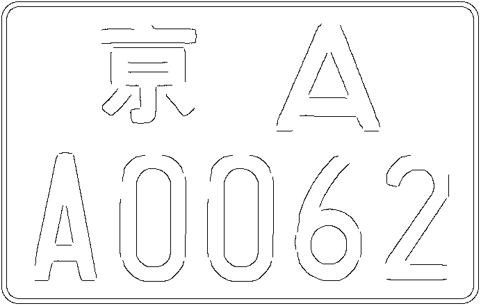
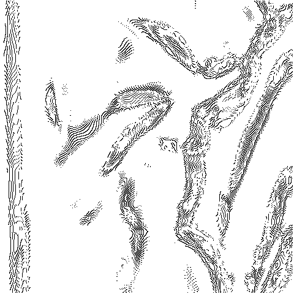

### 姓名：陈钦德&emsp;学号：17343010&emsp;专业：软件工程

首先我的学号是0结尾的,所以我是进行对Code0的代码进行改写。

这个Canny也就是如下几个步骤：

- 读入图片
- 进行高斯模糊
- 求梯度方向和大小
- 非最大值抑制
- 阈值抑制
- 写入图片

### 1.代码改写

分别是由Code0的代码里面的这几个函数实现的，我们这里使用CImg改写代码，我们的目的就是改写这些函数的写法。

- int read_pgm_image(char *infilename, unsigned char **image, int *rows,int *cols);
- int write_pgm_image(char *outfilename, unsigned char *image, int rows,int cols, char *comment, int maxval);
- void canny(unsigned char *image, int rows, int cols, float sigma,float tlow, float thigh, unsigned char **edge, char *fname);
- void gaussian_smooth(unsigned char *image, int rows, int cols, float sigma,short int **smoothedim);
- void make_gaussian_kernel(float sigma, float **kernel, int *windowsize);
- void derrivative_x_y(short int *smoothedim, int rows, int cols,short int **delta_x, short int **delta_y);
- void magnitude_x_y(short int *delta_x, short int *delta_y, int rows, int cols,short int **magnitude);
- void apply_hysteresis(short int *mag, unsigned char *nms, int rows, int cols,float tlow, float thigh, unsigned char *edge);

首先我们改写的是读取图片的函数，因为原本的Code0里面读取图片用的是PGM函数，所以这里的函数我们使用的是读PGM的，但是在CIMG中的处理是基于BMP类型的数据的，所以我们在这里自己将图片转化为了BMP类型的数据，同时实际上在Code0的代码里面并没有把图片转化为灰度图，因为PGM本身存储的就是灰度图的形式，所以它没有转化为灰度图的必要。

在大致清楚之后我们开始改写我们的代码，我将代码改写之后分装为了一个canny.h文件和canny.cpp文件，这样子方便我们的使用。

首先编写的是构造函数

	Canny::Canny(char *infilename1,char *outfilename1,float sigma1,float tlow1,float thigh1){
		   this->infilename = infilename1;
		   this->outfilename = outfilename1;
		   this->sigma = sigma1;
		   this->tlow = tlow1;
		   this->thigh = thigh1;
		   this->distance = 5;
			}
保存需要读取的文件名，保存的结果的文件名，还有高斯滤波的sigma，两个阈值，还有用来连接线条的距离，此处默认设置为5.

然后将RGB图片转化为灰度图，我们分别读取三个通道的数值，然后将其按照公式计算出来。

	void Canny::change_gray(){
		int width = image.width();
		int height = image.height();
		int depth = image.depth();
		CImg<unsigned char> gray1(width,height,depth,1);
		unsigned char r,g,b;
		unsigned char gr1 = 0;
		for(int i=0;i<width;i++){
		for(int j=0;j<height;j++){
			//Return a pointer to a located pixel value.
			r = image(i,j,0,0);
			g = image(i,j,0,1);
			b = image(i,j,0,2);
			gr1 = round(0.299*((double)r) + 0.587*((double)g) + 0.114*((double)b));
			gray1(i,j,0,0) = gr1;
			}
		}
		image = gray1;
	}

然后编写的是读取图片的函数。

	int Canny::read_bmp_image(){
		image.load_bmp(this->infilename);
		this->rows = image.height();
		this->cols = image.width();
		return 1;
	}

在读取图片的时候我们同时保存着图像的分辨率这在后面会有使用。

接下来编写的是保存函数。

	int Canny::write_bmp_image(){
		this->image.save(this->outfilename);
		return 1;
	}

就是把搞好的图像数据给保存起来，使用save函数就可以解决了。

接下来编写高斯模糊的函数
	
	void Canny::gaussian_smooth(){
		this->image.blur(this->sigma);
	}

直接调用CImg的blur函数，直接对我们的图像进行高斯模糊。

然后是求取梯度的方向
	
	void Canny::derrivative_x_y(short int **delta_x, short int **delta_y){
	   int r, c, pos;
	   if(((*delta_x) = (short *) calloc(rows*cols, sizeof(short))) == NULL){
	      fprintf(stderr, "Error allocating the delta_x image.\n");
	      exit(1);
	   }
	   if(((*delta_y) = (short *) calloc(rows*cols, sizeof(short))) == NULL){
	      fprintf(stderr, "Error allocating the delta_x image.\n");
	      exit(1);
	   }
	   for(r=0;r<rows;r++){
	      pos = r * cols;
	      (*delta_x)[pos] = image[pos+1] - image[pos];
	      pos++;
	      for(c=1;c<(cols-1);c++,pos++){
	         (*delta_x)[pos] = image[pos+1] - image[pos-1];
	      }
	      (*delta_x)[pos] = image[pos] - image[pos-1];
	   }
	   for(c=0;c<cols;c++){
	      pos = c;
	      (*delta_y)[pos] = image[pos+cols] - image[pos];
	      pos += cols;
	      for(r=1;r<(rows-1);r++,pos+=cols){
	         (*delta_y)[pos] = image[pos+cols] - image[pos-cols];
	      }
	      (*delta_y)[pos] = image[pos] - image[pos-cols];
		}
	}

计算梯度的强度

	void Canny::magnitude_x_y(short int *delta_x, short int *delta_y,short int **magnitude){
	   int r, c, pos, sq1, sq2;
	   if((*magnitude = (short *) calloc(rows*cols, sizeof(short))) == NULL){
	      fprintf(stderr, "Error allocating the magnitude image.\n");
	      exit(1);
	   }
	
	   for(r=0,pos=0;r<rows;r++){
	      for(c=0;c<cols;c++,pos++){
	         sq1 = (int)delta_x[pos] * (int)delta_x[pos];
	         sq2 = (int)delta_y[pos] * (int)delta_y[pos];
	         (*magnitude)[pos] = (short)(0.5 + sqrt((float)sq1 + (float)sq2));
	      }
	   }
	}

然后非极大值抑制，这个函数的代码就不具体进行展示了，然后就是阈值抑制之类的函数，这都是比较长的代码，不太好在这里展示，当然还有一些辅助的函数。

canny.h文件的内容：
	
	#ifndef _CANNY_
	#define _CANNY_
	#include <iostream>
	#include <math.h>
	#include "CImg.h"
	using namespace std;
	using namespace cimg_library;
	
	#define NOEDGE 255
	#define POSSIBLE_EDGE 128
	#define EDGE 0
	
	class Canny {
		private:
			CImg<unsigned char> image;
			char *infilename = NULL;  /* Name of the input image */
			char *outfilename = NULL;    /* Name of the output "edge" image */
	   		int rows, cols;           /* The dimensions of the image. */
	   		float sigma,              /* Standard deviation of the gaussian kernel. */
		 		tlow,               /* Fraction of the high threshold in hysteresis. */
		 		thigh;              /* High hysteresis threshold control. The actual
				        threshold is the (100 * thigh) percentage point
				        in the histogram of the magnitude of the
				        gradient image that passes non-maximal
				        suppression. */
			float distance;
		public:
			Canny(char *infilename1,char *outfilename,float sigma1,float tlow1,float thigh1);
			unsigned char show(int i, int j , int pos);
			void change_gray();
			int read_bmp_image();
			int write_bmp_image();
			void delete_line(unsigned char *edge);
			int find_length(unsigned char *edge,int pos,int *flag,int *num);
			void canny();
			void gaussian_smooth();
			void derrivative_x_y(short int **delta_x, short int **delta_y);
			void magnitude_x_y(short int *delta_x, short int *delta_y,short int **magnitude);
			void non_max_supp(short *mag, short *gradx, short *grady,unsigned char *result);
			void apply_hysteresis(short int *mag, unsigned char *nms,float tlow, float thigh, unsigned char *edge);
			void follow_edges(unsigned char *edgemapptr, short *edgemagptr, short lowval);
			void to_save_edge(unsigned char *edge);
			void connect_edge(unsigned char *edge);
			void set_distance(float new_distance);
	};
	#endif

在这之后我们可以查看原本的效果。

原图（左），效果图（右）

由上述的作图转化为了右图，三个参数分别为2 0.5 0.4
### 2.在原来的代码基础上, 增加一个函数：首先把相邻的边缘连成长的线条，并删除长度小于 20 的 Edge。分析删除这些短 Edge 有何优缺点? 

首先我们完全第一个需求，把相邻边缘连成长的线条，这里有些定义比较模糊，什么是相邻的边缘?没有具体解释，加上连成长的线条这个关键词，我做出如下的几个假设也就是我这里实现的具体要求。

- 相邻的定义，我们这个我自定义了一个distance，如果两个线条接近到这个程度就认为是可以相连起来的
- 连接起来的线是在同一个方向上延申出去，相连的。
- 同时如果是在同一个方向同时又满足在distance内的要求，但是又太短了就不符合我们要求，比如两条平行，很接近的线。

首先我实现了连接边的函数。

	void connect_edge(unsigned char *edge);

实现如下：

	void Canny::connect_edge(unsigned char *edge){
	   unsigned char *tempmapptr;
	   int x[8] = {1,1,0,-1,-1,-1,0,1},
	       y[8] = {0,1,1,1,0,-1,-1,-1};
	   	int num = 0,now_pos = 0,i;
	    unsigned char *new_edge;
		new_edge = (unsigned char *)calloc(rows*cols,sizeof(unsigned char));
		bool flag = true;
		for(int r=0,pos=0;r<rows;r++){
			for(int c=0;c<cols;c++,pos++){
				new_edge[pos] = NOEDGE;
				if(edge[pos] == EDGE){
					flag = true;
					for(i=0;i<8;i++){
						tempmapptr = edge + pos - y[i]*cols + x[i];
						if(*tempmapptr == EDGE){
							flag = false;
							break;
						}
					}
					if(flag)
						edge[pos] = NOEDGE;
				}
			}
		}
		int temp = 0;
		for(int r=0,pos=0;r<rows;r++){
			for(int c=0;c<cols;c++,pos++){
				if(edge[pos] == EDGE){
					now_pos = 0;
					new_edge[pos] = EDGE;
				   for(i=0;i<8;i++){
						tempmapptr = edge + pos - y[i]*cols + x[i];
						if(*tempmapptr == EDGE){
							num = 2;
							while(*tempmapptr != EDGE){
								temp = pos - num * y[i]*cols + num * x[i];
								if(temp >= 0 && temp % cols < rows && temp / rows < cols)
									tempmapptr = edge + temp;
								else break;
								num++;
							}
							now_pos = num;
							num++;
							while(num - now_pos < distance){
								temp = pos - num * y[i]*cols + num * x[i];
								if(temp >= 0 && temp % cols < rows && temp / rows < cols){
									tempmapptr = edge + temp;
									if(*tempmapptr == EDGE){
										int has_num = 0;
										for(int j = 1;j < 5;j++){
											temp = pos - (num + j)* y[i]*cols + (num + j) * x[i];
											if(!(temp >= 0 && temp % cols < rows && temp / rows < cols))	break;
											tempmapptr = edge + temp;
											if(*tempmapptr == EDGE)	has_num += 1;
										}
										if(has_num >= 3)	break;
									}
									num++;
								}
								else
								{
									temp = -1;
									break;
								}
							}
							if(num - now_pos != distance && temp >= 0){
								for(int j = now_pos;j <= num;j++)
									new_edge[pos - j * y[i]*cols + j * x[i]] = EDGE;
							}
						}
					}
	    	  }    	  
	  		}
	  	}
		for(int r=0,pos=0;r<rows;r++){
			for(int c=0;c<cols;c++,pos++){
				edge[pos] = new_edge[pos];
			}
		}
	}

我首先把孤立点给去掉了，然后扫描所有的点，如果是边缘，那么找出这条线的两头，然后在按照原本的方向延申出去，判断是否在distance的里面，如果在那么判断这个的长度再决定是否要连接起来，否则放弃，最后一步将最后的结果写入image中。

第二个实现的函数是删除长度短于20的线条，我的做法是找到边缘点后，去检测这个边缘点的八邻域，如果有边缘点则记录下来然后继续向下找出下一个边缘点，知道找不出为止，并且同时记录边缘点的个数（长度）。

使用find_length函数来得到线条的长度。

	int Canny::find_length(unsigned char *edge,int pos,int *flag,int *num){
	   unsigned char *tempmapptr;
	   int x[8] = {1,1,0,-1,-1,-1,0,1},
	       y[8] = {0,1,1,1,0,-1,-1,-1};
	   tempmapptr = edge + pos;
	   int length = 0;
	   bool notIn = true;
	   int temp;
	   for(int i = 0;i < 8;i++){
	   		temp = pos - y[i]*cols + x[i];
	   		tempmapptr = edge + temp;
	   		if(*(tempmapptr) == EDGE){
		   		notIn = true;
		   		for(int j = 1;j <= *num;j++){
		   			if(*(flag + j) == temp)
		   			{
		   				notIn = false;
		   				break;
		   			}
		   		}
		   		if(notIn){
		   			*num += 1;
		   			*(flag + *num) = temp;
		   			length += find_length(edge,temp,flag,num) + 1;
		   		}
		   	}
	   }
	   return length;
	}

使用delete_line来删除边缘。

	void Canny::delete_line(unsigned char *edge){
		int length = 0;
		int *flag,*num;
		num = (int *)calloc(1,sizeof(int));
		flag = (int *)calloc(cols*rows,sizeof(int));
		for(int r=0,pos=0;r<rows;r++){
			for(int c=0;c<cols;c++,pos++){
				// cout << c << " " << r << endl;
				if(edge[pos] == EDGE){
					length = 0;
					*(flag + 1) = pos;
					*num = 1;
					for(int i = 0;i < 8;i++){
						length += find_length(edge,pos,flag,num);
					}
					if(length < 20){
						for(int i = 1;i <= *num;i++)	edge[*(flag + i)] = NOEDGE;
					}
				}
			}
		}
	}

然后然后这是最后的两个结果，

连接线条效果图（左），删掉线条效果图（右）

连接线条效果图（左），删掉线条效果图（右）

我们可以很清晰的看得出不少的线段给连接上了，但是还有更多更长的没有办法连接起来，这需要后面算法的改进了。

而第二张图删除掉长度小于20的线条，我们可以看得到非常多席位的地方都给删除掉了，有种突然间图片就干净的效果。

连接线条效果图（左），删掉线条效果图（右）

这一张图像的效果显然更加明显。

而对于删掉小于20的线条有什么不好的影响呢？我们可以看下图。

连接线条效果图（左），删掉线条效果图（右）

删除掉长度小于20的边缘固然可以把一些噪音之类的东西给删除掉，但是也会带来如上图的问题，因为我连接边缘的算法不是非常的优秀，所以我们可以看得到再左图中两个0上面各有一个小边缘，我们人类是知道它是一些需要的信息，但是在删除掉小于20的边缘中我们把它给删除掉了，这是它的一些缺点。

### 3.对于参数的几个讨论。

1. 对于sigma参数，sigma参数主要是针对于高斯模糊的参数，如果说sigma太大了，那么会把图像处理的非常的模糊，这会给后面的边缘检测带来不少的问题，甚至让边缘检测无法识别出需要的边缘。

sigma:5（左），sigma:10（右）

sigma:15（左），sigma:20（右）

模糊越大到最后就不见了。

2. 对于阈值的问题，我们按照sigma值来进行讨论，阈值的相关大小会导致被检测出的线条的多寡。

0.1-0.2（左），0.1-0.4（右）

0.3-0.4（左），0.6-0.8（右）

两个阈值限定了出现的线条在一定的范围之内。